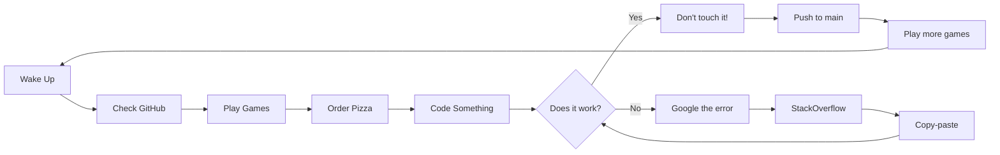

<div align="center">


# 👾 Hey, I'm Enfuir!

### 🎮 Retro Gaming Enthusiast | 💻 Hobby Programmer | 🍕 Pizza Connoisseur

[](https://github.com/Enfuir)
[](https://github.com/Enfuir)
[](https://github.com/Enfuir?tab=repositories)


</div>

---

## 🎮 About Me

Just a regular person who loves retro games and occasionally writes code when I'm bored. I spend most of my time playing indie games, watching YouTube, and trying to figure out why my code doesn't work 😅

<div align="center">

```javascript
const me = {
    hobbies: ["Gaming 🎮", "Pizza 🍕", "Memes 😂", "YouTube 📺"],
    skills: ["Googling errors", "Copy-pasting from StackOverflow", "Debugging by prayer"],
    currentlyPlaying: "Celeste, Hollow Knight, Stardew Valley",
    favoriteSnack: "Doritos + Mountain Dew",
    codingStyle: "It works? Don't touch it!",
    motto: "If it compiles, ship it! 🚀"
};
```

</div>

---

## 🕹️ What I Do

Mostly just mess around with code for fun! Nothing serious, just hobby projects and random experiments:

<table>
<tr>
<td width="50%">

### 🎯 **Random Projects**
- 🧮 **Calculator Apps** - Because why not?
- ✅ **To-Do Lists** - I have 5 (don't use any)
- 🤖 **Discord Bots** - Mostly useless but fun
- 📜 **Random Scripts** - Automate lazy stuff
- 🎲 **Game Mods** - Breaking games since 2020

</td>
<td width="50%">

### 🎨 **Learning (Very Slowly)**
- 🟨 **JavaScript/TypeScript** - Console.log() is my debugger
- 🐍 **Python** - For automating boring stuff
- 🎨 **HTML/CSS** - Still can't center a div
- 🔧 **Git** - I push to main, don't @ me
- 🎮 **Game Dev** - One day...

</td>
</tr>
</table>

---

## 📊 GitHub Stats

<div align="center">


</div>

<div align="center">


</div>

---

## 🎮 Favorite Games

<div align="center">

| 🕹️ Retro Classics | 🎨 Modern Indie | 🏆 All-Time Favorites |
|-------------------|-----------------|----------------------|
| 🍄 Super Mario World | ⛰️ Celeste | 🎭 Undertale |
| 🤖 Mega Man X | 🦋 Hollow Knight | ⏰ Chrono Trigger |
| ⏰ Chrono Trigger | 🌾 Stardew Valley | 🌾 Stardew Valley |
| ⚔️ Final Fantasy VI | 🎭 Undertale | ⛰️ Celeste |
| 🦔 Sonic 3 & Knuckles | 🎮 Hades | 🦋 Hollow Knight |

</div>

---

## 💭 Random Thoughts & Life Philosophy

<div align="center">

> **"Why does my code work? I have no idea. Why did it break? Also no idea."**

</div>

### My Daily Routine:



### I'm just here to:
- ✅ Play games
- ✅ Make random projects
- ✅ Procrastinate on actual work
- ✅ Eat pizza (lots of it)
- ✅ Watch YouTube at 3 AM
- ✅ Start new projects before finishing old ones
- ✅ Repeat

---

## 🛠️ Tech I Use (Sometimes)

<div align="center">

### **Languages & Frameworks**


### **Tools & Platforms**


### **Gaming Platforms**


</div>

---

## 🎯 Current Goals

<div align="center">

| Goal | Status | Progress |
|------|--------|----------|
| Actually finish a project | 🔄 In Progress | ▓▓░░░░░░░░ 20% |
| Learn to center a div properly | ❌ Failed | ░░░░░░░░░░ 0% |
| Beat Celeste without assist mode | 🎮 Trying | ▓▓▓▓▓░░░░░ 50% |
| Stop starting new projects | ❌ Failed | ░░░░░░░░░░ 0% |
| Touch grass | 🤔 Maybe | ░░░░░░░░░░ 5% |
| Finish Stardew Valley | ♾️ Never | ▓▓▓▓▓▓▓▓▓░ 90% |
| Order less pizza | ❌ Impossible | ░░░░░░░░░░ 0% |

</div>

---

## 🍕 Pizza Tier List

<div align="center">

### 🏆 **S Tier** (God Tier)
🍕 Pepperoni • 🍕 Supreme • 🍕 Meat Lovers

### ⭐ **A Tier** (Amazing)
🍕 Hawaiian (fight me) • 🍕 BBQ Chicken • 🍕 Margherita

### 👍 **B Tier** (Pretty Good)
🍕 Veggie • 🍕 Four Cheese • 🍕 Buffalo Chicken

### 🤷 **C Tier** (It's Pizza, So Still Good)
🍕 Pineapple & Jalapeño • 🍕 White Pizza

### 🚫 **F Tier** (Banned)
🍕 Anchovies (no thanks)

</div>

---

## 📫 Find Me

<div align="center">

[](https://github.com/Enfuir)
[](https://github.com/Enfuir?tab=repositories)

**Discord:** Probably gaming  
**Stack Overflow:** Asking why my code doesn't work  
**YouTube:** Watching speedruns at 3 AM

</div>

---

## 🎵 Currently Vibing To

<div align="center">

🎶 Celeste OST • 🎶 Hollow Knight OST • 🎶 Undertale OST  
🎶 Stardew Valley OST • 🎶 Lo-fi Hip Hop Radio

</div>

---

<div align="center">

## 🌟 Thanks for stopping by!


### 💖 Fun Fact

**I've spent more time customizing my VS Code theme than actually coding** 😅

---

### 📜 Wisdom of the Day

**"Code is like humor. When you have to explain it, it's bad."** - Cory House

**"It works on my machine."** - Every Developer Ever

**"I'm not lazy, I'm just on energy-saving mode."** - Me, probably

---

### 🎮 Achievement Unlocked!

**You've reached the end of my profile!** 🏆

*+100 XP • +1 GitHub Visitor • +1 Pizza Slice*

</div>
