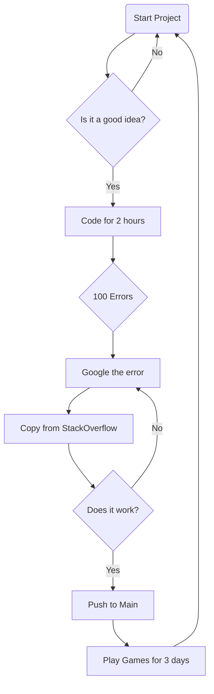

<div align="center">


# 👾 Hey, I'm Enfuir!
**Professional Bug Creator | Pizza Demolisher | Retro Game Hoarder**

;Actually+I+just+copy+from+StackOverflow;I+put+the+'pro'+in+procrastination;My+code+works...+on+my+machine;Bypassing+IOMMU+and+my+responsibilities)

---

### 🚀 Quick Stats for the Curious
[](https://github.com/Enfuir)
[](https://github.com/Enfuir)
[](https://github.com/Enfuir?tab=repositories)

</div>

---

## 👨‍💻 About the Chaos
I'm a hobbyist programmer who enjoys breaking things just to see if I can fix them (spoiler: I usually can't). When I'm not staring at a terminal wondering why my `git push` failed, I'm probably deep in a retro game or arguing why pineapple **does** belong on pizza.

```json
{
  "name": "Enfuir",
  "status": "Currently debugging my life",
  "dependencies": ["Caffeine", "Pizza", "Indie Games", "Google"],
  "special_skills": {
    "googling": "Expert",
    "breaking_prod": "Intermediate",
    "centering_divs": "In progress (since 2022)"
  },
  "operating_system": "Sarcasm v2.0"
}
```

---

## 🛠️ My "Toolbox" (Things I pretend to know)

<div align="center">

| **Languages** | **Tools & Platforms** | **Gaming** |
| :--- | :--- | :--- |
|  |  |  |
|  |  |  |
|  |  |  |
|  |  |  |

</div>

---

## 📈 The Proof of My Procrastination

<div align="center">


<br/>


</div>

---

## 🕹️ Top Tier Entertainment
| 🍄 Retro | ⛰️ Indie | 🏆 GOATs |
| :--- | :--- | :--- |
| Super Mario World | Celeste | Chrono Trigger |
| Mega Man X | Hollow Knight | Undertale |
| Final Fantasy VI | Stardew Valley | Stardew Valley |
| Sonic 3 & Knuckles | Hades | Celeste |

---

## 🍕 The Official Pizza Tier List (Objective Truth)
- **S Tier:** Pepperoni, Supreme, Meat Lovers (The Holy Trinity)
- **A Tier:** Hawaiian (**Yes, it's good.**), BBQ Chicken, Margherita
- **B Tier:** Veggie, Four Cheese, Buffalo Chicken
- **F Tier:** Anchovies (Literal crime against humanity)

---

## 🎯 Current Quests
- [ ] Actually finish a project instead of starting 5 new ones (`Progress: 15%`)
- [ ] Beat Celeste Chapter 9 without crying (`Progress: 40%`)
- [ ] Find a way to automate my social life (`Progress: 0%`)
- [ ] Center a `<div>` on the first try (`Status: Impossible`)

---

## 🧠 My Development Workflow

```mermaid
graph TD
    Start(Start Project) --> Idea{Is it a good idea?}
    Idea -- No --> Start
    Idea -- Yes --> Code[Code for 2 hours]
    Code --> Error{100 Errors}
    Error --> Google[Google the error]
    Google --> Stack[Copy from StackOverflow]
    Stack --> Works{Does it work?}
    Works -- No --> Google
    Works -- Yes --> Main[Push to Main]
    Main --> Games[Play Games for 3 days]
    Games --> Start
```

---

<div align="center">

### 📬 Catch Me If You Can
**Discord:** `Probably Gaming` | **StackOverflow:** `Searching for hope`


*"I'm not lazy, I'm just on energy-saving mode."* 🔋

**Achievement Unlocked: Profile Stalker!** 🏆  
*+100 XP | +1 Pizza Slice | +1 Respect*

</div>
