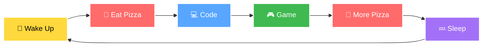

 

---

## 🎮 About Me

```mermaid
graph LR
    A[🌅 Wake Up] --> B[🍕 Eat Pizza]
    B --> C[💻 Code]
    C --> D[🎮 Game]
    D --> E[🍕 More Pizza]
    E --> F[💤 Sleep]
    F --> A
    
    style A fill:#FFD93D,stroke:#fff,stroke-width:2px,color:#000
    style B fill:#FF6B6B,stroke:#fff,stroke-width:2px,color:#fff
    style C fill:#58A6FF,stroke:#fff,stroke-width:2px,color:#fff
    style D fill:#3FB950,stroke:#fff,stroke-width:2px,color:#fff
    style E fill:#FF6B6B,stroke:#fff,stroke-width:2px,color:#fff
    style F fill:#A371F7,stroke:#fff,stroke-width:2px,color:#fff
```

---

## 🍕 Pizza Tier List

| Tier | Pizza Type | Rating |
|------|-----------|--------|
| 🏆 **S-Tier** | Pepperoni | ⭐⭐⭐⭐⭐ |
| 🥇 **A-Tier** | Hawaiian | ⭐⭐⭐⭐ |
| 🥈 **B-Tier** | Margherita | ⭐⭐⭐ |
| 🥉 **C-Tier** | Veggie | ⭐⭐ |
| 💀 **F-Tier** | Pineapple-Free | ❌ |

---

## 💻 Tech Stack

### Languages & Frameworks

### Tools & Technologies

### Specializations

---

## 🚀 Featured Projects

### 🔐 Security & IOMMU Research

<table>
<tr>
<td align="center" width="33%">

</td>
<td align="center" width="33%">

</td>
<td align="center" width="33%">

</td>
</tr>
</table>

### 📊 Enterprise Monitoring Systems

<table>
<tr>
<td align="center" width="33%">

</td>
<td align="center" width="33%">

</td>
<td align="center" width="33%">

</td>
</tr>
</table>

---

## 📊 GitHub Stats

---

## 🏆 GitHub Trophies

---

## 🎯 Current Focus

- 🔬 **Security Research**: IOMMU bypass techniques and hypervisor development
- 📊 **Real-Time Analytics**: Building enterprise-grade monitoring systems
- 🎮 **Game Research**: DMA-based game analysis and modification
- 🍕 **Pizza Testing**: Trying every pizza place in town (serious business)

---

## 📫 Connect With Me

---

**"Code, Game, Pizza, Repeat" 🍕🎮💻**

